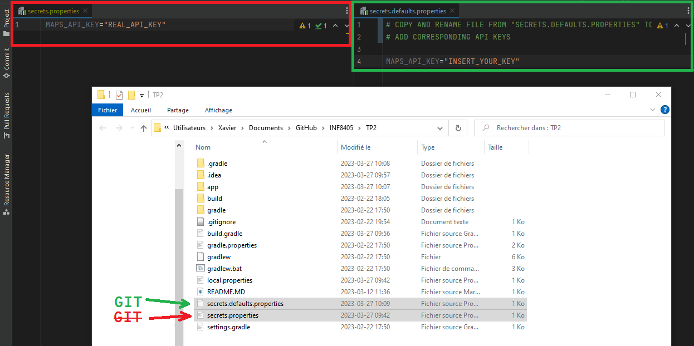
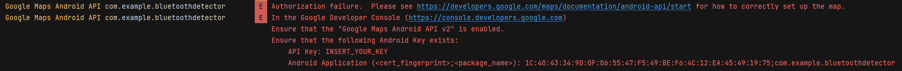
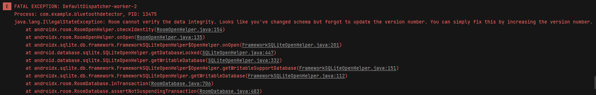
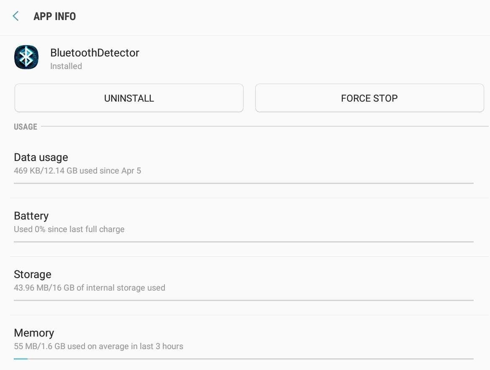
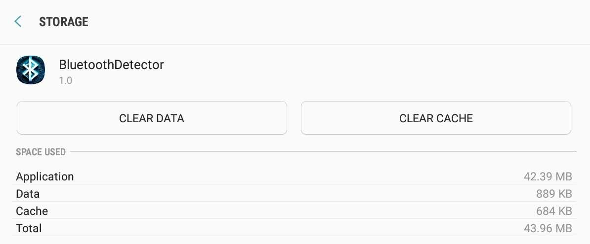

# GRADLE SECRETS

1. Copy `secrets.defaults.properties` to `secrets.properties`
2. Enter API key(s) in `secrets.properties`
3. `secrets.properties` will not be tracked by version control



Otherwise, error will be thrown at runtime and Maps features will not work



# PERMISSIONS

## Use ADB (Windows)
```cmd
cd /d %LOCALAPPDATA%\Android\sdk\platform-tools
```

## List devices
```cmd
adb devices
```

## Reset permissions on specific device
```cmd
adb shell -s <device> pm reset-permissions bluetoothdetector
```

# ROOM DATABASE ERROR (CRASH ON LAUNCH)
## Crash logs ("Room cannot verify the data integrity ...")

## Access applications  settings

## Clear storage (data & cache)
